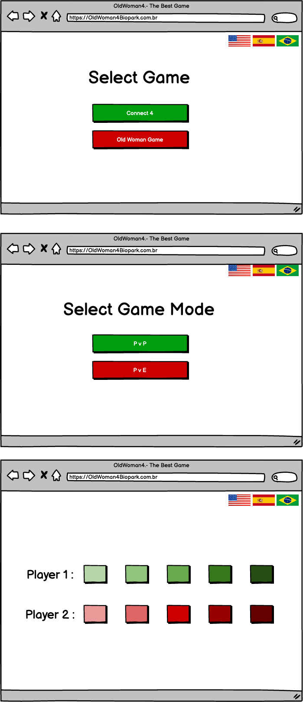
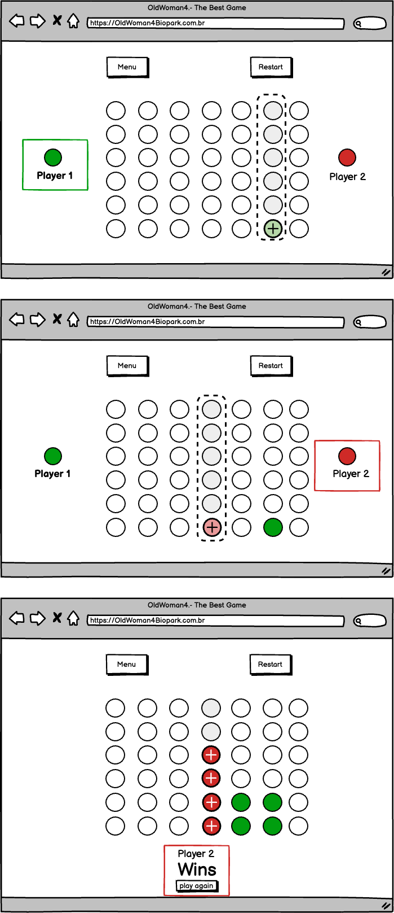
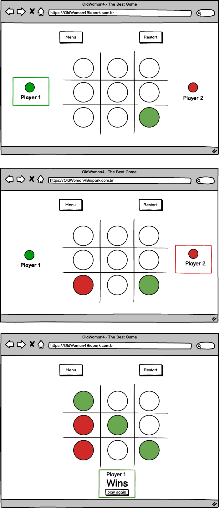

## Connect4.API
Web API criada durante a disciplina de Arquitetura de Software como forma de avaliação parcial.

## Front-end
[Front-end connect4] (https://github.com/cintyahx/connect4)

## Desenvolvedores
Cintya Miotto - cintyadallacosta@gmail.com  
Edineia Brum - edineiabrum@gmail.com  
Eduardo Linke - eduardomlinke@hotmail.com  
Jaqueline M Nunes - jaque.malman@gmail.com  
Jonas Sidney - jonasidney@gmail.com  
Renata Filadelfo - renata.filadelfo1@gmail.com

## Documentação

[Documentação Completa Em PDF](documentacao.pdf)

[MIRO](https://miro.com/welcomeonboard/WWkwRmh4bHNvdThsSGMxNlBZY2xjWG9rNTkzWEF5N2VSRkZCZWVHbUJJSGx3SG1wd0NWOVZNeDlTaThhZEJwVHwzNDU4NzY0NTYwNDQ3MDY1NjY3fDI=?share_link_id=16074902350)

[Protótipo Balsamiq](https://balsamiq.cloud/shbrc0s/psn0uk8)

## Protótipos

## Referências
- [tk-codes/ConnectFour](https://github.com/tk-codes/ConnectFour)
- [ernestoyaquello/TwoPlayerZeroSumGameEngine](https://github.com/ernestoyaquello/TwoPlayerZeroSumGameEngine)
