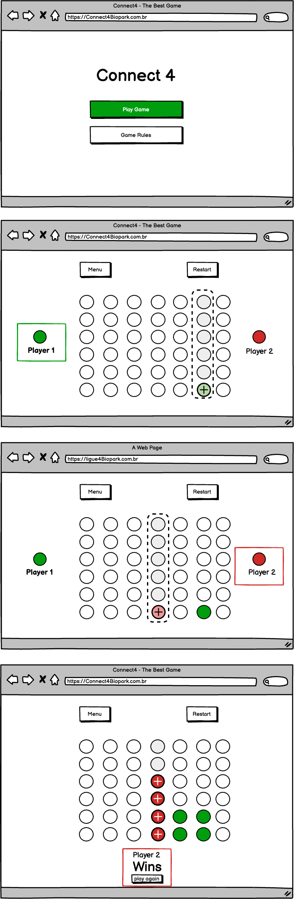

## Connect4.API

Web API criada durante a disciplina de Arquitetura de software como forma de avaliação parcial.

## Desenvolvedores
Cintya Miotto - cintyadallacosta@gmail.com  
Eduardo Linke - eduardomlinke@hotmail.com  
Edineia Brum - edineiabrum@gmail.com  
Jaqueline M Nunes - jaque.malman@gmail.com  
Jonas Sidney - jonasidney@gmail.com  
Renata Filadelfo - renata.filadelfo1@gmail.com

## Pré-requisitos
* Runtime
  *  [.Net SDK](https://dotnet.microsoft.com/download/dotnet) - Development kit.
* Dev tools:
  *  [Rider](https://www.jetbrains.com/rider) - JetBrains .NET IDE.
  *  [Visual Studio](https://visualstudio.microsoft.com/downloads) - Microsoft IDE.
  *  [Visual Studio Code](https://code.visualstudio.com) - Microsoft Text Editor.
  
[MIRO](https://miro.com/welcomeonboard/WWkwRmh4bHNvdThsSGMxNlBZY2xjWG9rNTkzWEF5N2VSRkZCZWVHbUJJSGx3SG1wd0NWOVZNeDlTaThhZEJwVHwzNDU4NzY0NTYwNDQ3MDY1NjY3fDI=?share_link_id=16074902350)

[Protótipo Balsamiq](https://balsamiq.cloud/shbrc0s/psn0uk8)

## Referências
- [tk-codes/ConnectFour](https://github.com/tk-codes/ConnectFour)

## Protótipo
